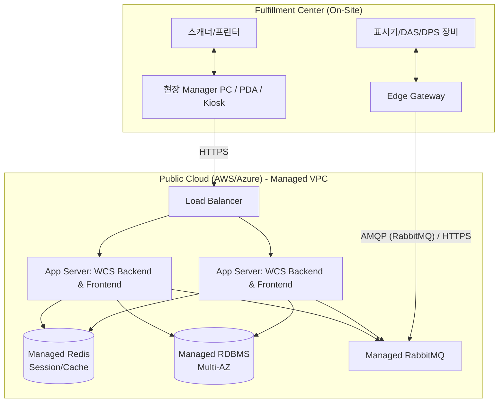

# 소규모 풀필먼트 센터(월 10만 건) Operato WCS 도입 아키텍처 및 비용 예측

**작성일자:** 2026년 3월 1일
**대상 센터 규모:** 소규모 풀필먼트 센터 (월 온라인 주문 10만 건, 일평균 약 3~4천 건 처리)

이 문서는 Operato WCS를 도입할 때 **클라우드(SaaS/IaaS) 서비스 이용 방식**과 **온프레미스(직접 하드웨어 구축) 방식**의 아키텍처를 비교하고, 온프레미스 구축 시 예상되는 하드웨어 비용을 산출한 자료입니다.

---

## 1. 아키텍처 구조 비교

월 10만 건 규모의 센터는 동시 접속자 수와 시스템 부하가 비교적 낮으므로 극단적인 분산 처리보다는 **안정성과 가성비**에 초점을 맞춘 아키텍처가 적합합니다.

### 1.1 클라우드 (SaaS/IaaS) 아키텍처

클라우드 환경은 초기 구축 비용이 없고 트래픽 증가 시 유연하게 확장(Scale-out)이 가능한 것이 장점입니다. 



**클라우드 구성의 특징:**
- **서버 구성:** 확장성(HA)을 고려하여 최소 2대의 WCS Application Server를 이중화로 배치합니다. (각 2vCPU, 8GB RAM 수준의 인스턴스로 충분)
- **데이터베이스:** 관리형 DB 서비스(Managed RDBMS, Redis, MQ)를 사용하여 백업, 패치 등 운영 부담을 제거.
- **현장 연결:** 현장과 클라우드 간의 통신 지연(Latency) 해소가 중요하므로, 최소 100Mbps 이상의 안정적인 인터넷 회선(원활한 RabbitMQ 메시지 큐 통신 목적)이 필수적입니다. 설비 제어의 빠른 응답을 위해 현장에 **Edge Gateway** PC를 둡니다.

---

### 1.2 온프레미스 (직접 하드웨어 구축) 아키텍처

로컬 구축형은 데이터 보안을 자체 통제할 수 있으며, 클라우드와의 통신 지연(네트워크 레이턴시)이 발생하지 않아 설비(표시기) 반응 속도가 가장 빠릅니다.

```mermaid
graph TD
    subgraph "Fulfillment Center (On-Site Server Rack)"
        L4[L4 Switch / Nginx HAProxy] --> Node1[Server Node 1: WCS App + RabbitMQ]
        L4 --> Node2[Server Node 2: WCS App (Hot-Standby) + DB Slave]
        Node1 --> DB_M[(RDBMS Master)]
        Node2 --> DB_S[(RDBMS Slave)]
        Node1 --> Cache[(Redis)]
    end
    
    subgraph "Fulfillment Center (Work Area)"
        Client[현장 Manager PC / PDA / Kiosk] -- "LAN" --> L4
        GW[Edge Gateway (Optional)] -- "LAN" --> Node1
        Indicator[표시기/DAS/DPS 장비] <--> GW
    end
```

**온프레미스 구성의 특징:**
- **서버 구성:** 월 10만 건 규모의 경우 단일 랙서버로도 충분히 커버가 가능하지만, H/W 장애를 대비해 **물리 서버 2대**를 Active-Standby(또는 Active-Active 앱 + 마스터-슬레이브 DB) 구조로 묶습니다. Docker Compose 기반으로 배포하여 관리합니다.
- **네트워크:** 내부 기가비트 물리망(LAN)을 통해 통신하므로 설비 제어 시 네트워크 지연 제로에 가까운 성능을 발휘합니다.
- **관리 요건:** 항온항습, UPS(무정전 전원 장치), 정기 백업 보관 등 물리적 인프라 관리가 자체적으로 필요합니다.

---

## 2. 클라우드 방식과 온프레미스 방식 장단점 비교

| 구분 | 클라우드 서비스 운영 | 온프레미스 운영 (하드웨어 구매) |
|------|----------------|--------------------------|
| **초기 투자비용(CAPEX)** | **매우 낮음** (0원에 가까움) | **높음** (서버, 랙, 네트워크 장비 구매 필요) |
| **운영 유지비용(OPEX)** | 월 사용료 발생 (서버, DB 등) | 낮음 (전기/통신, 유지보수 비용 발생) |
| **응답 속도 (Latency)** | 인터넷 회선 품질에 의존 (10~50ms 발생) | **매우 우수함** (현장 로컬 통신 < 1ms) |
| **인프라 운영/관리** | CSP(AWS등)가 대행, 전문가 불필요 | **전문가 필요** (HW 장애 대응, DB 백업 관리) |
| **무중단 이중화/백업** | 클릭 몇 번으로 용이하게 구성 | 별도의 클러스터링 및 백업 솔루션 솔루션 구축 필요 |

**권장:** 소규모 센터(월 10만 건)에서는 **초기 투자 비용 절감 및 IT 관리 인력 최소화를 위해 기본적으로 클라우드(SaaS) 방식을 추천**합니다. 단, 보안 정책상 망분리가 필수이거나, 소터기 연동 등 극도로 빠른 설비 반응 속도(ms 단위)가 필요한 경우에는 온프레미스로 구성합니다.

---

## 3. 온프레미스 도입 시 예상 하드웨어 비용 (월 10만 건 규모 기준)

월 10만 건(일평균 3,300건 대비 피크 타임 고려)을 처리하기 위한 가성비 중심의 최소 권장 하드웨어 내역입니다. (소프트웨어/라이선스 및 컨설팅 비용은 제외된 순수 H/W 및 인프라 구축 비용입니다.)

> **주의:** 하드웨어 가격은 벤더(HP, Dell, Lenovo 등)의 정책 및 환율, 시장 상황에 따라 크게 달라질 수 있으므로 참고용으로만 활용하십시오.

### 3.1 최소 구성 (단일 서버 운영 - 장애 허용 낮음)

가용한 초기 자본이 매우 적을 경우 사용하는 구성입니다.
- **WCS 서버:** 2U 랙서버 1대 (Intel Xeon Silver 8-core CPU, 32GB RAM, 1TB SSD RAID1 구성) — 약 3,500,000 ~ 5,000,000원
- **네트워크 및 장비:** 24포트 기가 허브, 미니 서버랙, 소형 UPS 1대 — 약 800,000 ~ 1,500,000원
- **Edge Gateway PC:** 산업용 미니 팬리스 PC 1대 (설비 제어용) — 약 400,000원
- **총 예상 비용 (최소) : 약 4,700,000원 ~ 6,900,000원**

### 3.2 권장 구성 (이중화 서버 포함 - 가용성 보장)

센터 운영 중단 시 매출 손실이 크므로 장애 대비를 위한 권장 스펙입니다.
- **WCS 서버 (Active):** 2U 랙서버 1대 (Intel Xeon 8-core, 32GB RAM, 1TB SSD RAID1) — 약 4,500,000원
- **WCS 서버 (Standby):** 동일 스펙 1대 (장애 대비 동기화) — 약 4,500,000원
- **인프라 장비:**
   - 하프 랙(Half Rack) 및 쿨링 팬 — 약 700,000원
   - L3/L4 매니지드 스위치 — 약 1,200,000원
   - 랙 마운트형 대용량 UPS (정전 대비 최소 1시간 버퍼) — 약 1,500,000원
   - 로컬 백업용 2베이~4베이 NAS (8TB) — 약 800,000원
- **Edge Gateway PC:** 1대 — 약 400,000원
- **총 예상 비용 (권장) : 약 13,600,000원 ~ 15,000,000원**

*(주: PDA, PC, 바코드 스캐너, 무선 AP 등 현장 작업자가 직접 사용하는 디바이스와 설비(표시기) 자재 비용은 제외된, 백엔드 서버 룸 인프라만의 견적입니다.)*
