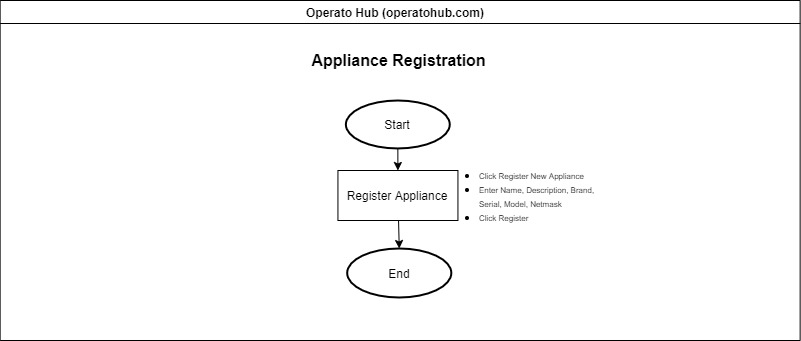
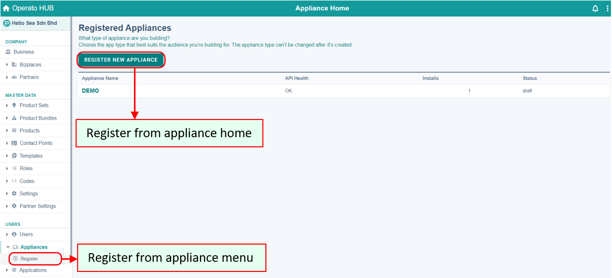
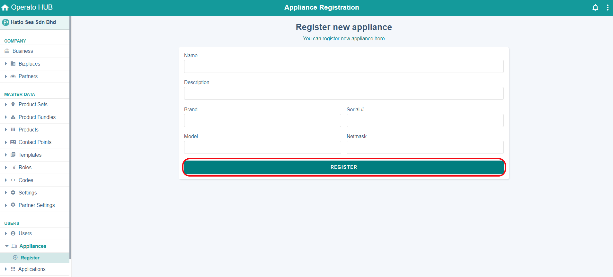
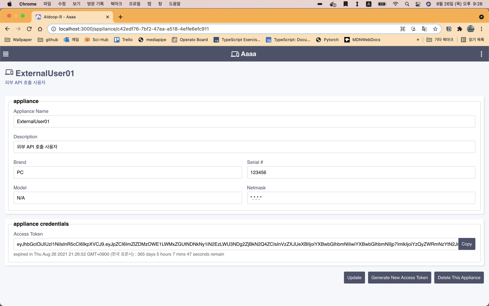
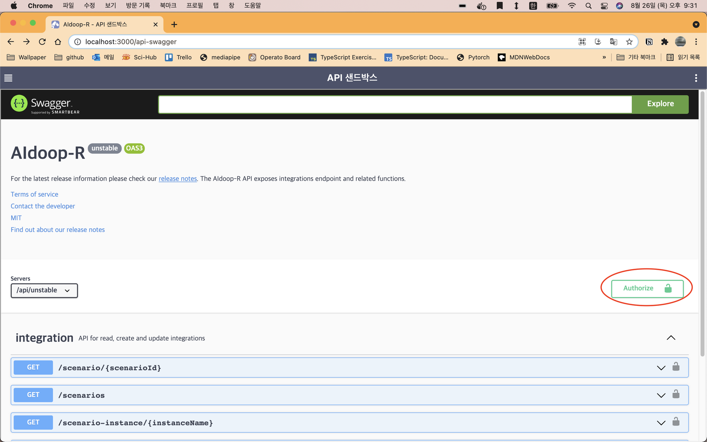
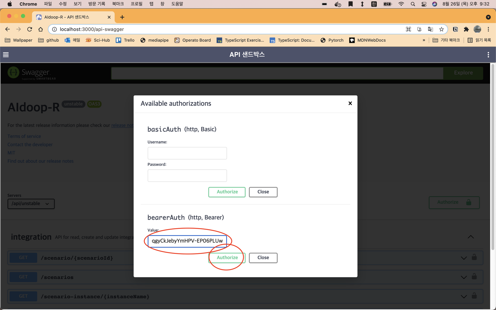
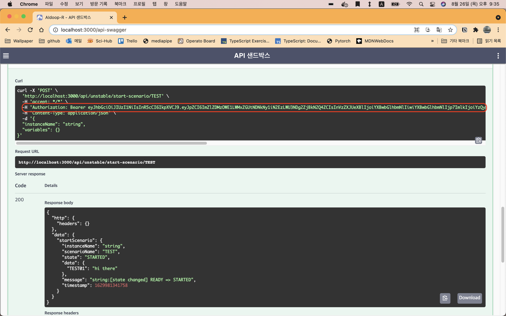

# 어플라이언스

외부 단말장치에서 API를 통해서 시스템을 사용하는 경우에 사용자가 로그인 프로세스를 진행하기 어려운 경우가 많은데, 이 경우에는 어플라이언스(단말장치) 유저를 등록하고 장기 사용 가능한 액세스토큰을 생성해서 인증을 진행하면 편리하다.

## <ins>어플라이언스(단말장치) 등록하기</ins>

1. 다음과 같이 단말장치를 등록할 수 있다:

- 사이드바의 '단말장치' 메뉴를 실행하면 단말장치 등록 화면을 볼 수 있다.
  

2. 기본 정보를 입력하고 'register' 버튼을 클릭한다.
   

## <ins>어플라이언스(단말장치) 정보 갱신</ins>

1. 단말장치 이름을 클릭하여 단말장치 정보화면으로 이동
2. 관련 정보를 수정한 뒤
3. **Update** 버튼을 클릭

## <ins>어플라이언스(단말장치) 정보 삭제</ins>

1. 단말장치 이름을 클릭하여 단말장치 정보화면으로 이동
2. **Delete This Appliance** 버튼을 클릭

## <ins>어플라이언스(단말장치) 테스트</ins>

단말장치는 사용자 타입중 한가지로 이해될 수 있다. 단말장치가 생성되면 일반 사용자와 같이 역할을 부여하고 원하는 정보에 접근할 수 있다.

일반 사용자는 로그인 화면을 통해서 인증 절차를 거치지만, 단말장치는 그런 과정을 거치기 어렵기 때문에, 단말장치에서 API 호출시 인증 정보에 포함할 수 있도록 액세스토큰을 생성해서 사용한다.

1. 단말장치 액세스토큰 생성하기
   'Generate New Access Token' 버튼을 클릭해서 Access Token을 생성한다.
   
2. 'API 샌드박스'에서 사용자 API를 시험하기 이전에 Authorize 버튼을 누르고 Bearer에 위에서 생성한 액세스토큰을 복사한 후 Authorize 버튼을 눌러서 Login한다.
   
   
3. 시나리오 실행(start-scenario)을 수행해 보면, 다음과 같이 헤더에 Authorization 항목이 추가된 것을 확인하실 수 있다. 실제로, 단말장치로부터 API 호출을 구현할 때, 같은 방법으로 API를 호출하면 인증을 해결할 수 있다.
   
