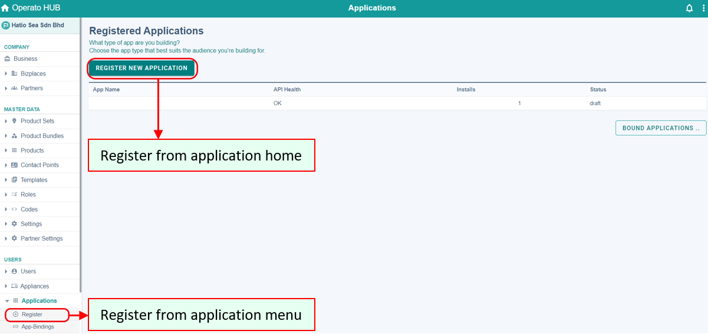
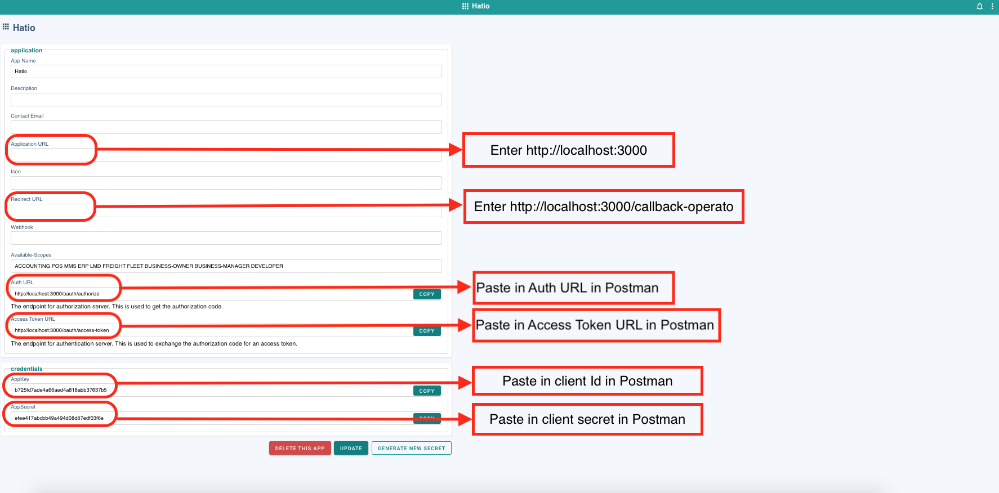
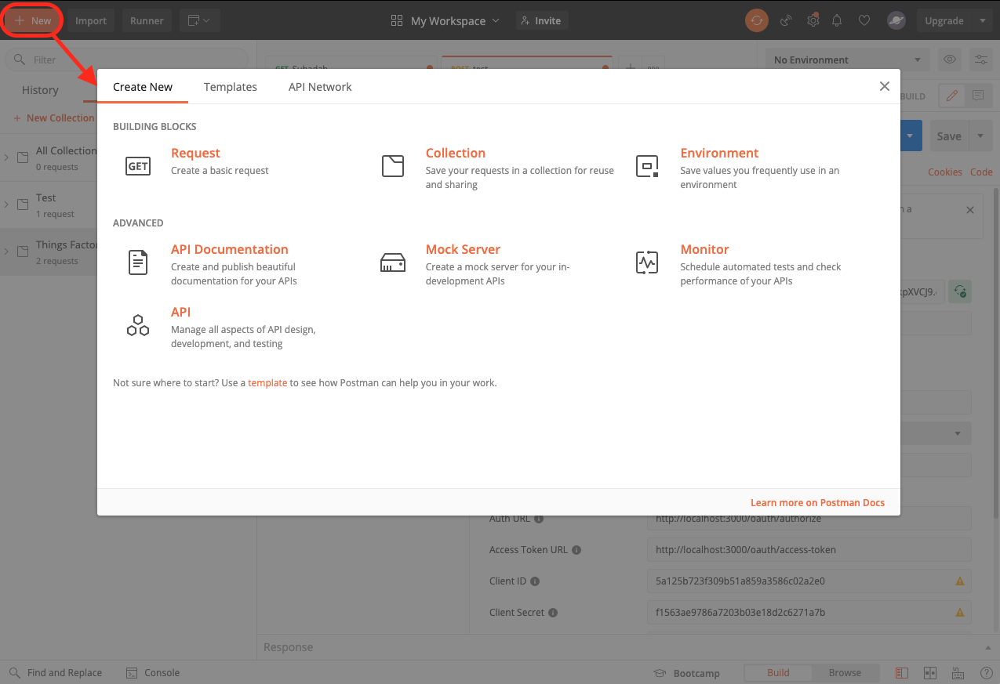
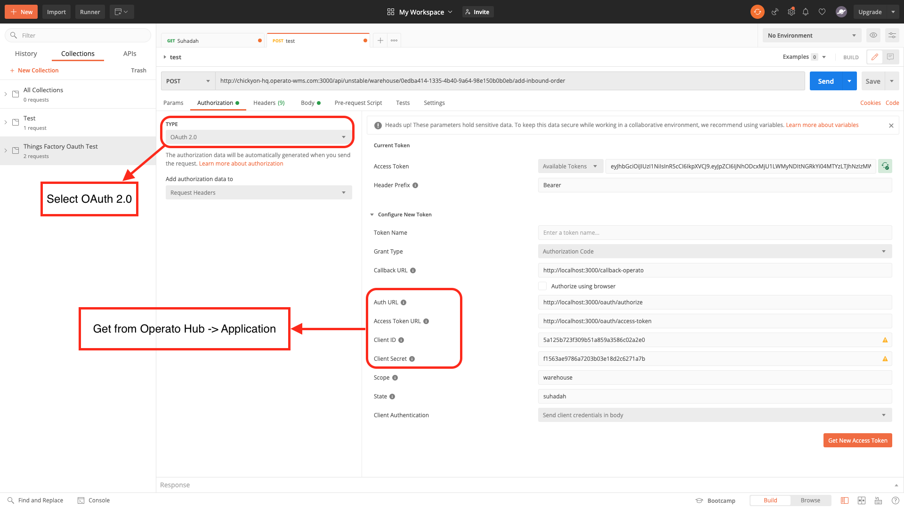
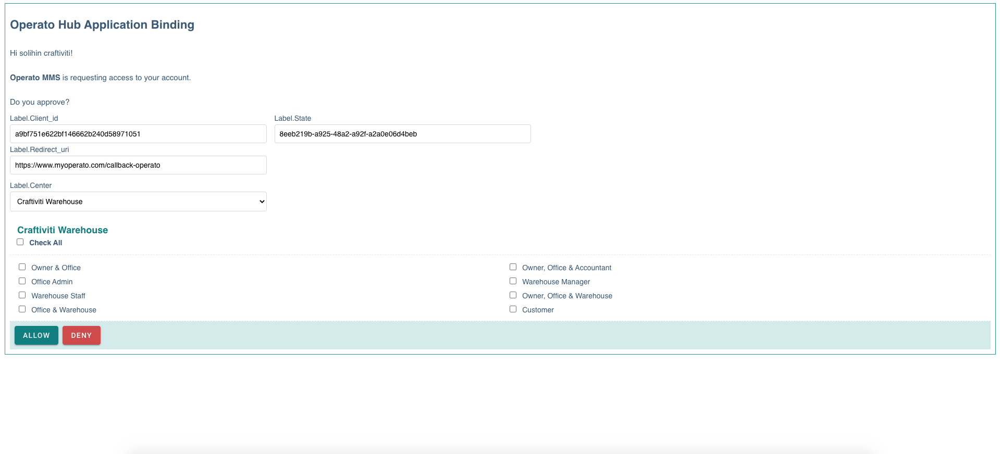

# Applications

This page allows third party applications to integrate with Operato by registering the application in Operato HUB.

## <ins>Register Application</ins>
Register an application
1.	You can register an application:
- From the Applications menu in the sidebar
- On the Applications page

2.	Enter all necessary information.
3.	Click Register New Application.

## <ins>How to use application</ins>

4.	Enter http://localhost:3000 in the Application URL section and http://localhost:3000/callback-operato in the Redirect URL section.
5.	Copy the Auth URL, Access Token URL, AppKey, AppSecret one by one and paste them into the Postman application.

## <ins>One-time setup of Postman application</ins>
6.	Click the + New button in the top left corner.

7.	Click Request 
8.	Enter the request name and select a collection.
Authorize URL
9.	Select OAuth 2.0 in the type section
10.	Paste the copied URL and credentials in step 5 into the Auth URL, Access Token URL, Client ID, and Client Secret.

11. Click Get New Access Token and the image below will be displayed.

12.	Click one of the roles you want to assign and click ALLOW to connect Operato with a third party application. Click DENY to abort the operation. 