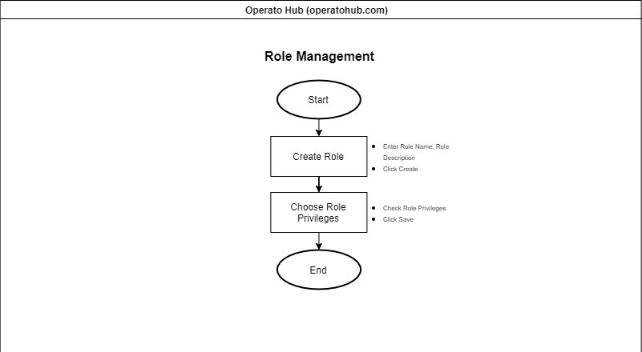
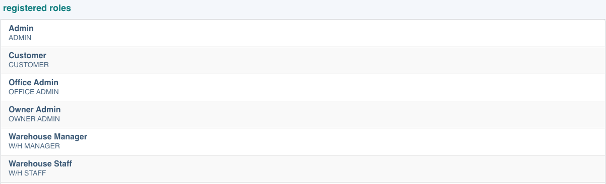
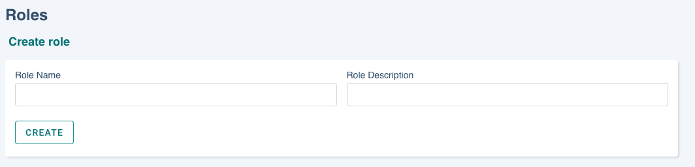
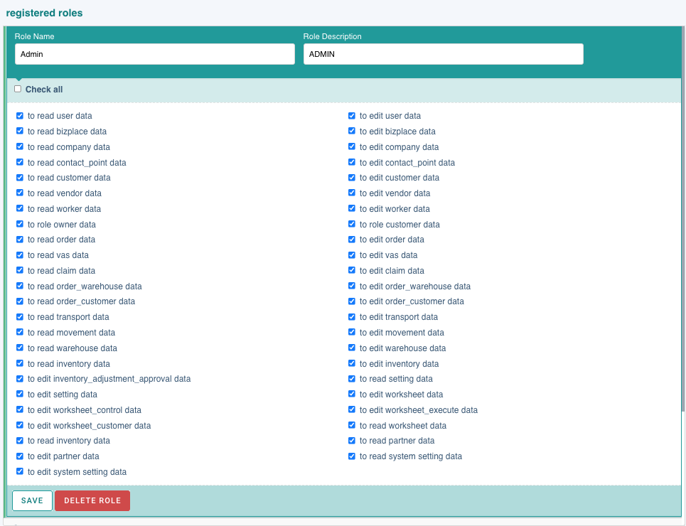

# Roles

Operato has roles for users’ access rights. Each role confers a different set of privileges for a given user of Operato. For example, users who have **Admin** rights can restrict other users’ access rights so that they cannot view or modify internal information.

### Properties

- **Roles**: job (title) or role name
- **Privileges**: privileges to access the system

### Role List

You can search the roles registered by domain.

### Type of Roles

1. Main role

- It has privilege to access Operato.

| ROLES             | PRIVILEGE                                                                                                                                                   |
| :---------------- | :---------------------------------------------------------------------------------------------------------------------------------------------------------- |
| Admin             | Can invite users to Operato Hub, have full privilege in WMS                                                                                                 |
| Customer          | Can create Goods Arrival Notice (GAN) and Release Order (RO), and view reports                                                                              |
| Office admin      | Can receive or approve the request of Goods Arrival Notice (GAN), Release Order (RO), activate worksheets and generate reports in Operato WMS for customers |
| Warehouse manager | Execute unloading, putaway, returning, picking, batch picking and loading                                                                                   |
| Warehouse staff   | Execute unloading, putaway, returning, picking, batch picking and loading                                                                                   |

---

2. Shared role

- It is used to assign menus in the Operato WMS.

## <ins>Create Role</ins>

**Admins** can add any role they want.

1. Enter the name and description according to the form format.
2. Click 

## <ins>Update Role</ins>

Click on a role name to edit the role's name, description and privileges.

### Role Privilages

Below the role name, a list of access rights for functions is displayed. After checking the desired authority, click 

You can grant roles to users in a bizplace through the **User Management** menu which is accessible through the **Users** tab in the sidebar.

## <ins>Delete Role</ins>

You can delete unused roles. Please note that if a partner is using a role, it cannot be deleted.
