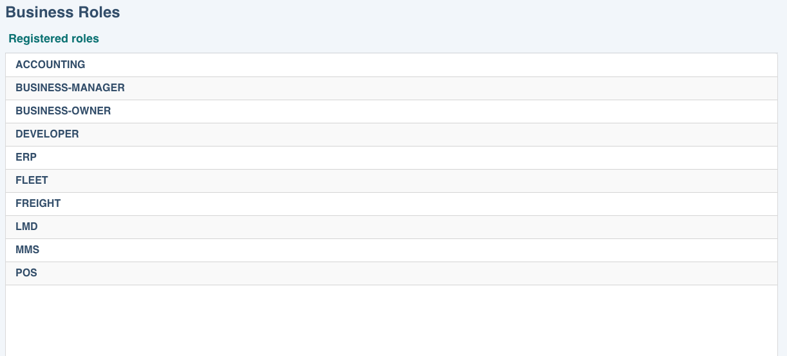
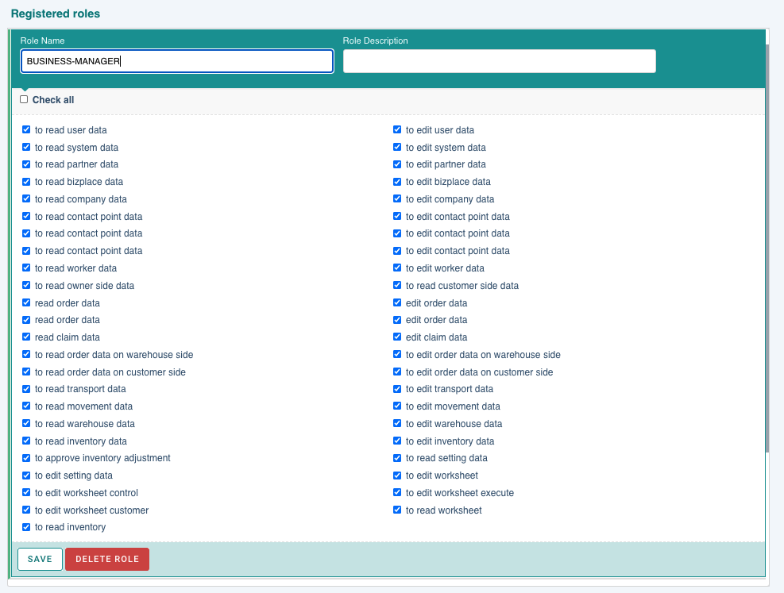

# roles

operato는 사용자들의 접근 권한을 위한 역할들이 존재합니다. 각각의 역할에 따라 operato system을 사용하는 기능들에 대한 접근 권한을 둘 수 있습니다. 
예를 들어, 관리자 권한이 없는 일반 사용자의 경우 내부 정보를 조회하거나 수정할 수 없도록 읽기, 편집 등의 접근 권한을 제한할 수 있습니다. 

## porperties

- **roles**
  : 직업(직책)이나 역할 이름

- **privileges**
  : 시스템에 접근할 수 있는 권한

## role list

도메인별로 등록된 role을 조회할 수 있습니다. 

 

## create role

관리자는 원하는 role을 추가할 수 있습니다. 

form 형식에 맞게 name, description을 입력 후 'create' 버튼을 클릭하여 생성합니다. 
(role의 privileges는 role을 추가한 후 추가된 role을 클릭하여 수정할 수 있습니다.)

## update role

role 이름을 클릭하면 해당 role의 이름, 설명과 privileges를 수정할 수 있습니다.

### role privileges

role name아래에는 기능들에 대한 접근 권한 리스트가 보여지며, 원하는 권한을 체크한 후 'save'버튼을 클릭하여 저장합니다.

_<u>사용자에게 role을 부여하려면 user 관리 메뉴에서 도메인에 속한 사용자들의 role을 설정할 수 있습니다.</u>_

## delete role

사용하지 않는 role을 삭제할 수 있습니다. 
<u>\* partner에서 role을 사용하고 있을 경우 삭제가 되지 않습니다.</u>
