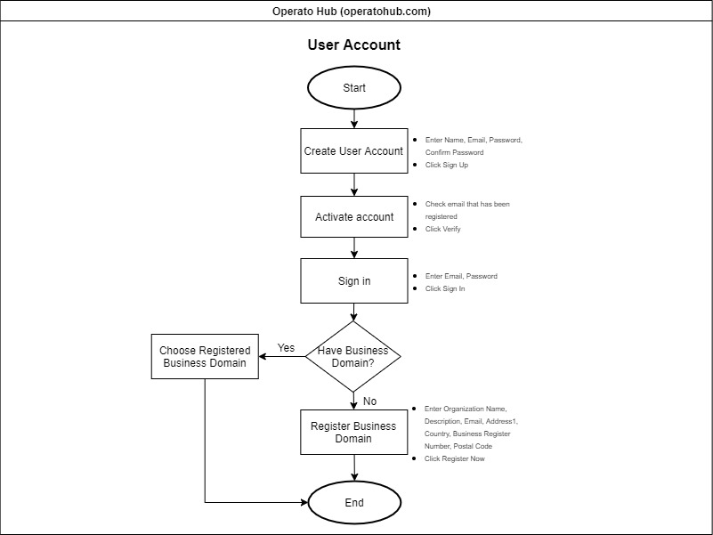
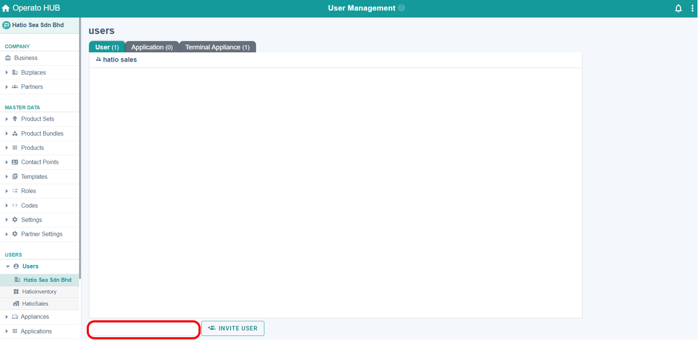
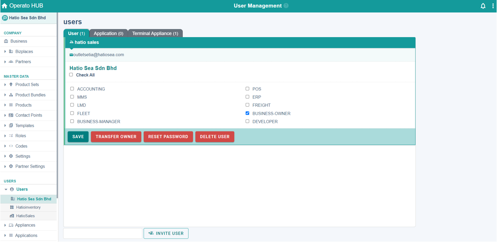
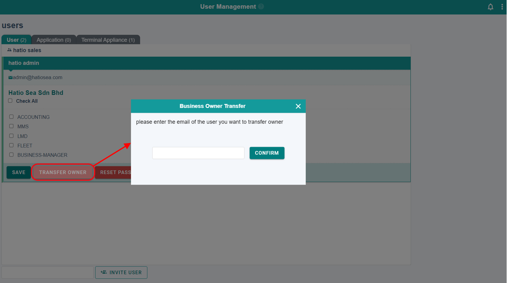
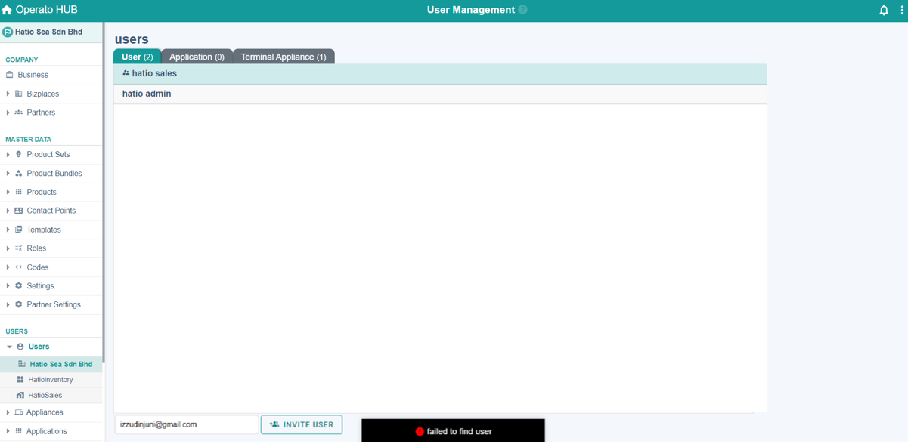

# Users

All users in your business are displayed on the **User Management** screen. You can invite users to a bizplace, edit roles, or remove users.
There are three types of users: general user, application, and appliance.

## <ins>Invite users to your bizplace</ins>
You can invite registered users by entering their email address.

1.	Enter the email address of the user in the box as shown below.
2.	Click **INVITE USER**. You can assign a role to each user you invite to your bizplace.

## <ins>Update roles</ins>
Click on a user to see the roles they have been assigned. Click in the check box next to each role to assign or remove that role, then press 

## <ins>Delete User</ins>
To remove a user from a bizplace, select the user then click **DELETE USER**. You can delete all users except the owner. Note that this does not delete a user’s account, just their access to this bizplace.

## <ins>Transfer Owner</ins>
If you are the owner of the bizplace you have the option to select another user to become the owner. 
1. Click the user you want to designate as the owner of the domain. 
2.	Click **TRANSFER OWNER**. 
3. Enter the email address of the user you wish to transfer ownership to.
4. Click **CONFIRM**. Note that changing the owner may limit the functions that the current user can access.

## <ins>ERROR MESSAGE</ins>
| ERROR MESSAGE | EXPLANATION |
| :------------:| :----------:|
|  ! Failed to find user | Users must have previously registered their email address in Operato.|
|
