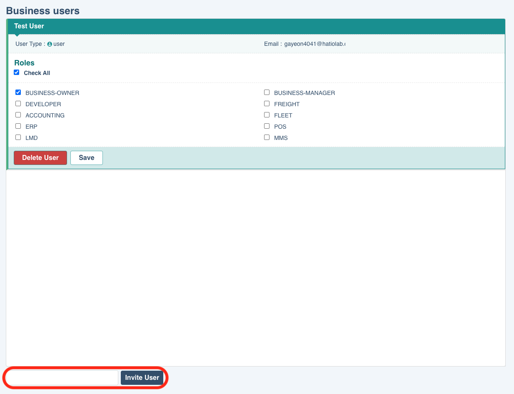
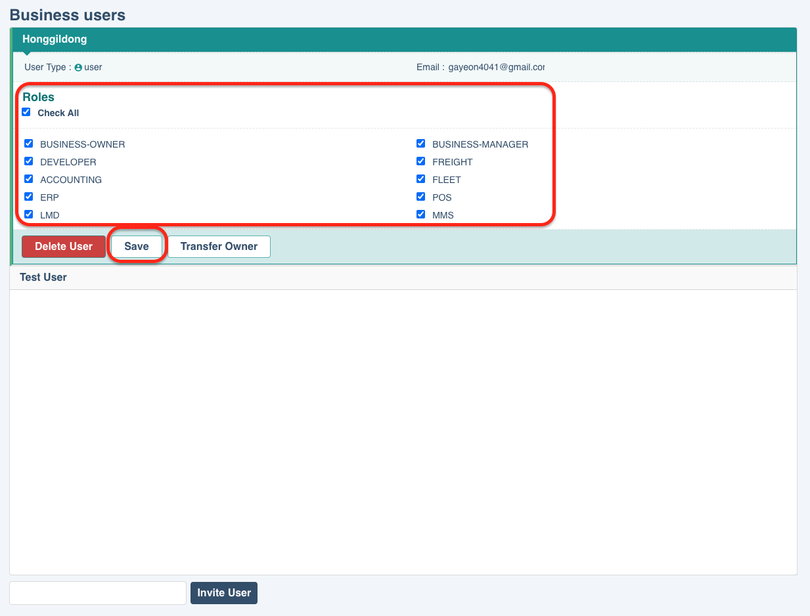
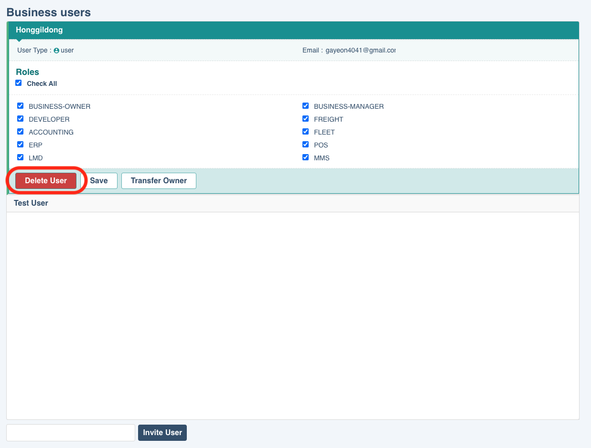
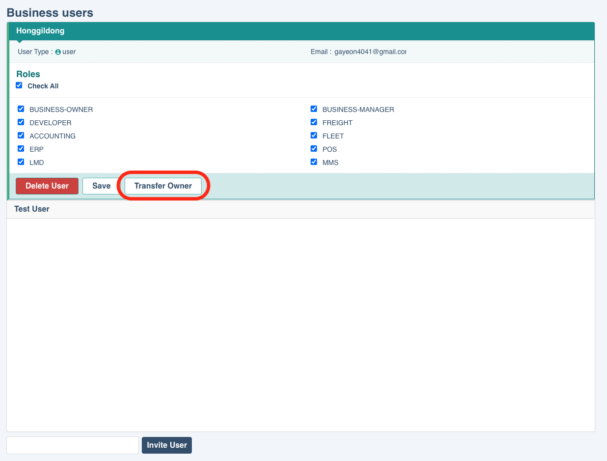
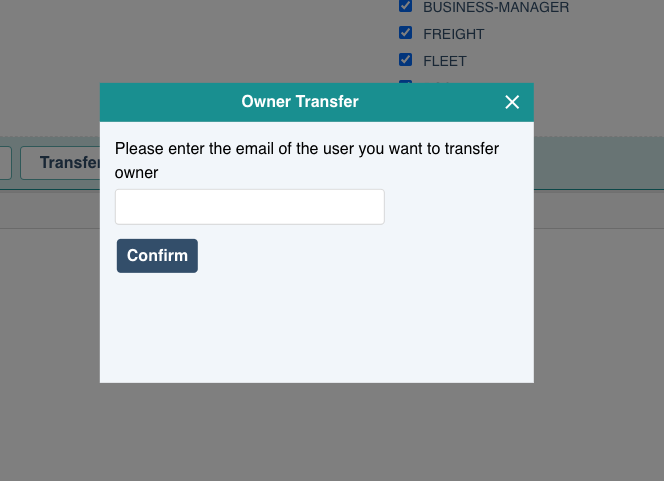

# users

각 도메인에 소속된 사용자들을 보여줍니다. 사용자를 도메인에 초대할 수 있으며, 등록된 사용자에 대해 role을 편집하거나 사용자를 삭제할 수 있습니다. 
users는 일반 사용자(user)와 application, appliance 세 가지의 타입이 존재합니다. 

## porperties

- **users**
  : 사용자 정보(이름, 이메일 등) 조회

- **roles**
  : 사용자가 소속된 도메인별로 부여할 수 있는 역할(직책)

## Invite Users

사용자를 추가하는 기능입니다. 가입된 사용자의 이메일을 입력하여 초대할 수 있습니다.  

초대하려는 사용자의 이메일을 입력한 후 'invite user' 버튼을 클릭합니다.
초대된 사용자는 해당 도메인에 대한 role을 지정할 수 있습니다.

## Update Roles

update roles는 해당 도메인에 접근할 수 있는 역할을 설정하는 기능입니다.
역할마다 서로 다른 권한이 존재합니다.

파트너쉽에 의해 부여받은 역할 또한 설정할 수 있습니다.
유저에 맞게 roles을 부여한 후 'save'버튼을 클릭하여 수정사항을 저장합니다.

## Delete User

사용자를 삭제하는 기능입니다.  

더이상 사용하지 않는 user를 'Delete User' 버튼을 클릭하여 삭제합니다. owner를 제외한 모든 사용자를 삭제할 수 있습니다. 
도메인에 접근할 수 있는 사용자를 제거하는 기능이며, 사용자가 영구적으로 삭제되는 것은 아닙니다.

## Transfer User

해당 도메인의 owner를 변경하는 기능입니다.  \*_현재 user 타입의 사용자가 도메인의 owner인 경우에만 나타나는 기능입니다._ 

도메인의 owner로 지정하고 싶은 사용자를 클릭하면 'transfer owner' 버튼이 나타납니다. 

transfer owner 버튼을 클릭하면 변경하려는 사용자의 이메일을 확인하기 위한 팝업이 나타납니다. 
비즈니스 계정의 소유자로 변경하고자 하는 사용자의 이메일을 정확히 입력한 후 'confirm' 버튼을 클릭합니다. 

\*_owner를 변경하면 현재 유저가 접근할 수 있는 기능이 제한될 수 있습니다._

## Update Apps

도메인에 등록된(appKey를 가진) 모든 application, appliance (apps) 리스트를 조회할 수 있습니다. 
app을 사용할 땐, 활성화(activate)하고 사용하지 않을 경우엔 비활성화(deactivate)를 선택합니다. 
