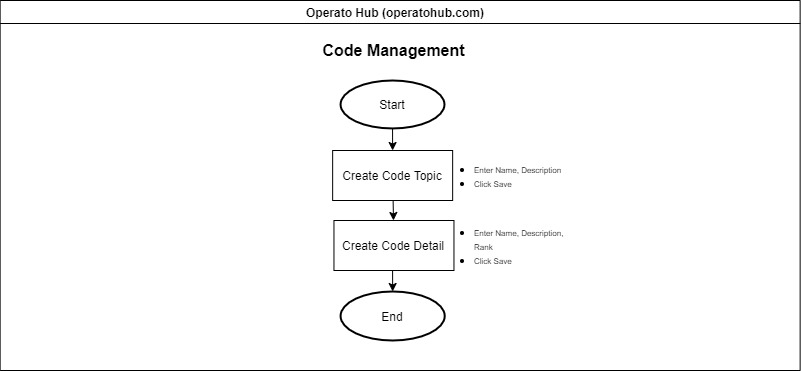
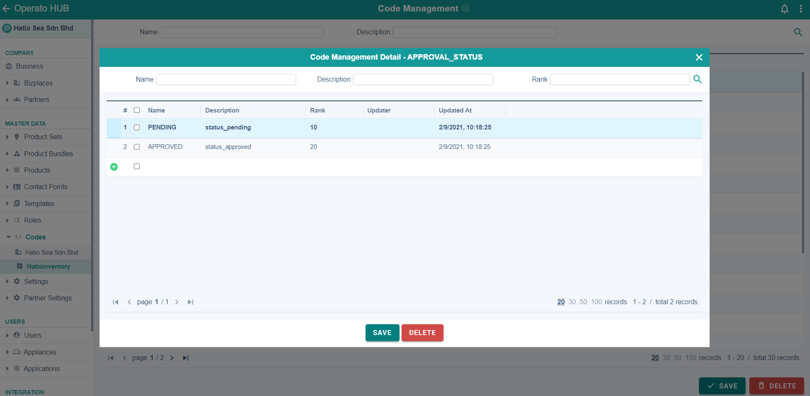

# Code Management

This is a page that manages all common codes used in the Operato for all bizplaces. It creates and manages codes such as product type, country type, and order status.

## <ins>Add a common code topic (group of codes)</ins>
1. On the last row in the list (which has a green plus  at the beginning), double click on each column row to enter the information.
2. Click 
3. If you click the **Menu** button  for any code topic, a pop-up (see below) will appear where you can enter individual codes belonging to that topic.

4. Double click on columns in the desired  the row to enter the information. Note that **Rank** represents each code’s position in a list (in ascending order)
5. Click 

## <ins>Delete element (individual code)</ins>
1. Click on the check box to the left of to the name of the element.
2. Click 

## <ins>Delete code topic</ins>
1. Click on the check box to the left of the desired topic (note that the code will only delete if there are no elements inside it)
2. Click 
