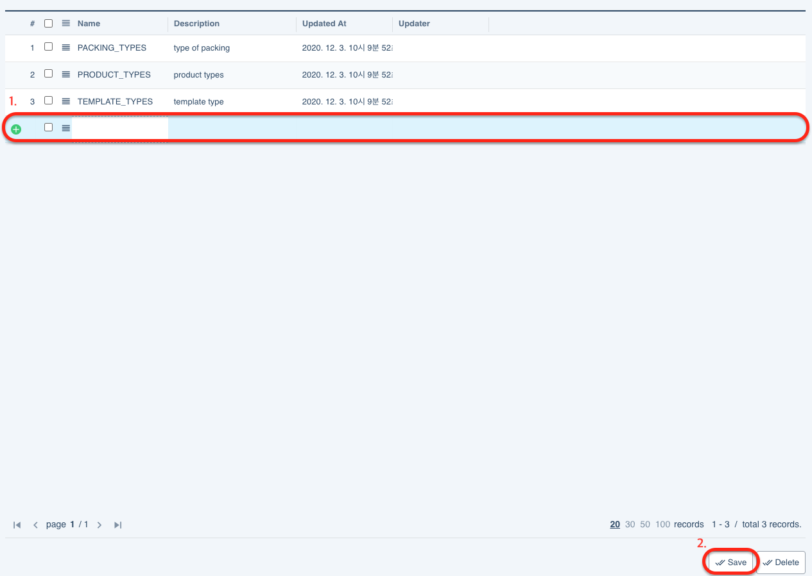
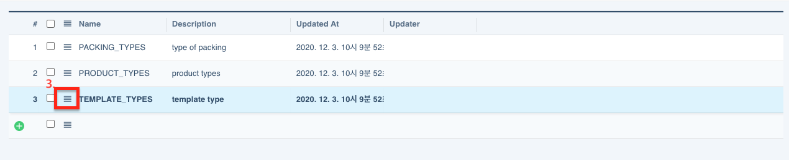
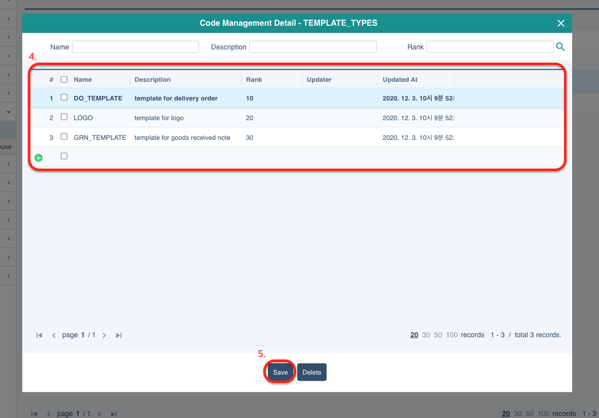

# code management

operato 시스템에서 사용하는 모든 common code를 각 도메인별로 관리하는 페이지입니다. 
상품의 타입이나 국가 타입, 주문 상태 등의 code를 생성하고 관리합니다.

## Add common code

1. '+' 아이콘 옆 빈 테이블에 code name과 description을 입력합니다.
2. 오른쪽 하단에 'save' 버튼을 클릭하면 code가 생성됩니다.
   

3. 추가한 code의 name 왼쪽 햄버거 버튼을 클릭하면 code 내부 요소들을 입력할 수 있는 팝업창이 나타납니다.

   

4. code에 들어갈 요소들을 하나씩 추가합니다. name, description, rank를 모두 작성합니다. 
   <u>\*rank는 요소들의 정렬 순서를 나타냅니다. 정렬 형식은 오름차순 기준입니다.</u>
5. 하단에 'save' 버튼을 클릭하여 변경사항을 저장합니다.

   
