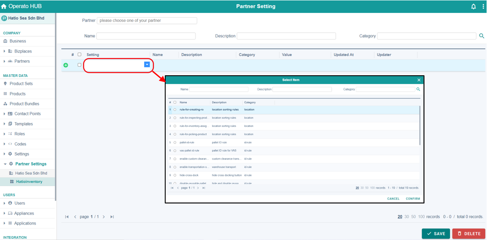
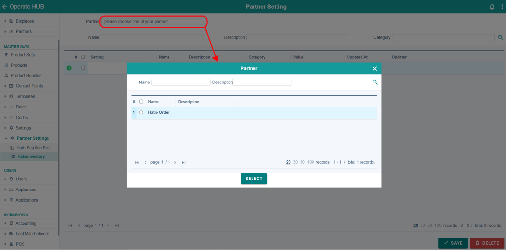
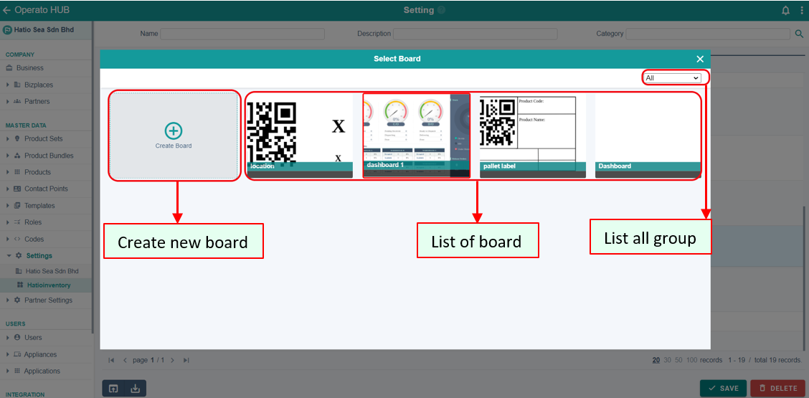

# PARTNER SETTING
## <ins>Add Setting</ins>
1.	Click on the partner field and select the partner for you to set the setting.

2.	Click 
3.	In the bottom row in the list of setting (there should be a green plus sign   at the beginning of the row), click in the setting columns to add new setting for your partner. 

4.	Click 

### Properties
| SETTING | STEPS |
| :-------| :-----|
| Value from list of board | 1. Double click on the row or column you want to update.   2. Click on the board you want to use.  3. Click 
| Value from create new board | 1. Double click on the row or column you want to update.  2. Click on Create Board.    3. Enter all necessary information.  4. Click **Create**.  5. Click 

## <ins>Delete setting</ins>
1.	Click on the check box left to the setting name.
2.	Click 

